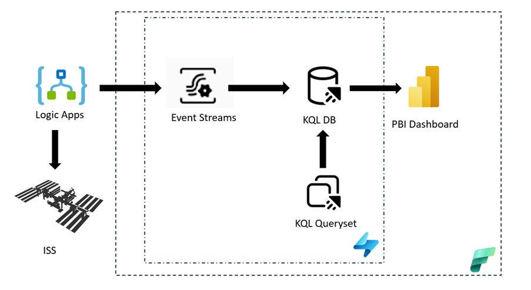
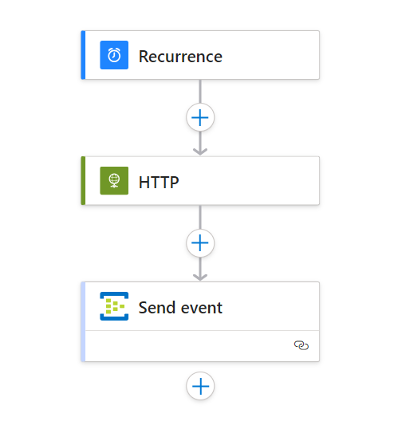
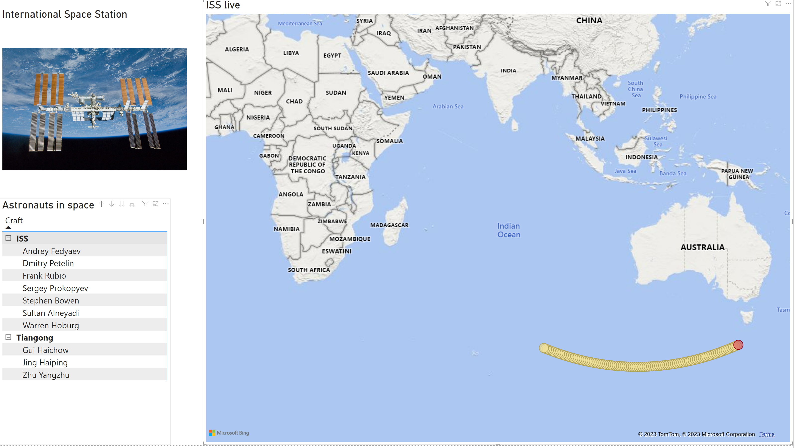
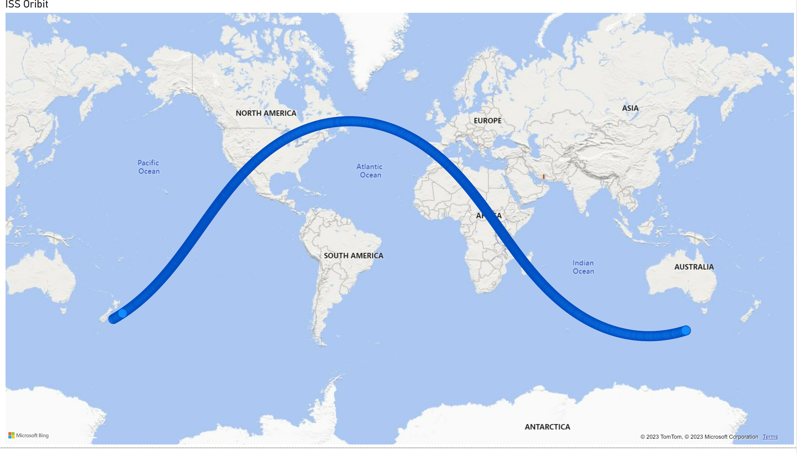

# Tracking International Space Station with Microsoft Fabric

### Visualizing End-to-end flow

In this scenario, we will use –

•Logic Apps to pull the current location of ISS (every 5 sec) and few other stats such as which are the astronauts in space along with their crafts, and send to an Event Stream

•KQL Database to store this information in real-time.

•KQL Query set to analyse the data ad-hoc.

•PowerBI to visualize the recent location and astronaut details.

### Demo setup instructions

#### 1. LogicApps to pull the ISS data 

We will use Open-notify API (http://open-notify.org/Open-Notify-API/) to fetch the location of ISS and astronatut info  in real-time. LogicApps flow is scheduled to run every 5 secs, and sends a notification to EventStreams using EventHub activity.

You can import the logicapps flow from [here](./logicapps)
There are two separate flows for fetching location and astronaut details, which sends events to two distinct Event Streams in Fabric.

#### 2. KQL Database to store the real-time stream

Follow the instructions in [this](https://learn.microsoft.com/en-us/fabric/real-time-analytics/event-streams/stream-real-time-events-from-custom-app-to-kusto) tutorial to create an Event Streams, KQL Database and add a destination to eventstream.
Once you add a KQL Database to the destination, data will start flowing in KQL Database. 

Please note you need to configure the LogicApps flow in #1 to send data to the Event Streams endpoint created. 

#### 3. KQL Queryset to analyze the data ad-hoc

Try playing with the data by using [kql queries](./kql/ISS.kql)

#### 4. Create a Dashboard 

Import the [PBI Dashboard](./PBI/ISS.pbix) and change the parameters *kusto_db_url* and *kusto_db_name* with your KQL Database URI and DB name. 
You can configure the Dashboard to auto-refresh every 5sec to see the craft moving live.

